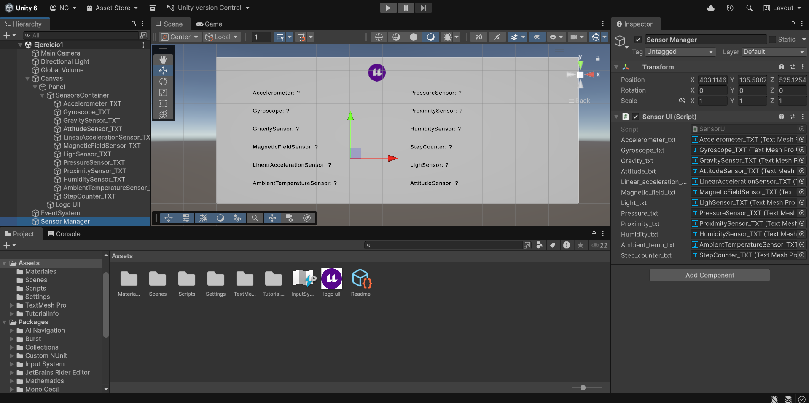
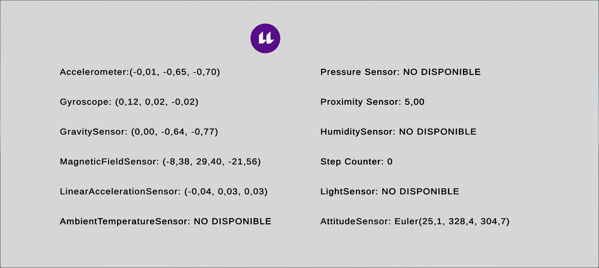
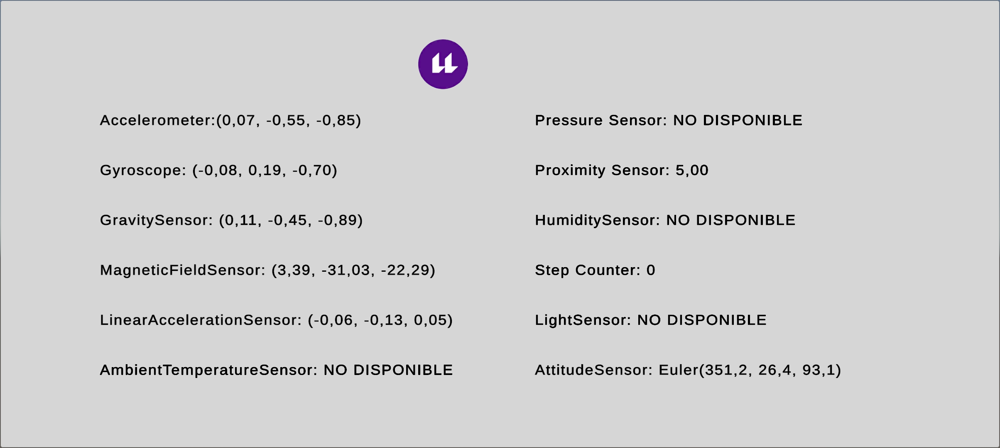
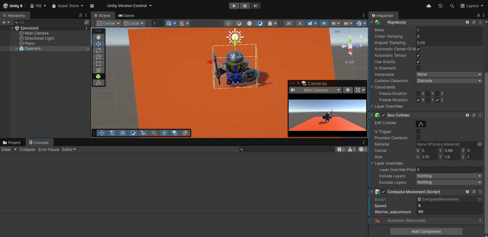

# Interfaces Inteligentes
## Práctica 9. Sensores
### Alumna: Nailea Fayna Cruz Galván (alu0101477497)

**Descripción:** En esta práctica se ha propuesto realizar una serie de ejercicios básicos con el objetivo de aprender a utilizar los sensores de Android. En este fichero, explicaré dichas tareas y cómo las llevé a cabo.

Cabe destacar que generé un apk para cada uno de los ejercicios, de forma que se puedan probar más simple.

### Ejercicios

1. **Crear una aplicación en Unity que muestre en la UI los valores de todos los sensores disponibles en tu móvil. Incluir en el Readme una medida de los valores en el laboratorio y otra en el jardin de la ESIT.**

Para este ejercicio cree un Script muy sencillo ([SensorUI.cs](Scripts/SensorUI.cs)) que lee en tiempo los sensores que estén disponibles del móvil y muestra sus valores en la interfaz.

Como se pide en el ejercicio, fui al jardín y al centro de cálculo y estos fueron los valores obtenidos según los sensores:

- **Jardín**

- **Centro de Cálculo**

- El **apk** generado es el siguiente: [ejercicio1](apk/ejercicio1.apk)

---

2. **Crear una apk que oriente alguno de los guerreros de la práctica mirando siempre hacia el norte.**

Para lograr esto cree un script [CompassMovement.cs](Scripts/CompassMovement.cs) que lee el **sensor de campo magnético** y rota al guerrero en tiempo real según la orientación. De esta manera, sin importar cómo gires el móvil, el guerrero siempre mira hacia el norte.

En realidad, yo quería usar directamente `Input.compass`, pero no me estaba funcionando correctamente en el móvil. Así que al final terminé usando el sensor de campo magnético, que sí me permitió obtener la orientación de forma más estable. Tuve que ajustar el valor de `warrior_adjustment` a 90 para que el guerrero realmente apuntara hacia el norte en la escena.

En esta imagen podemos ver que, efectivamente, el **guerrero mira hacia el norte**:

- El **apk** generado es el siguiente: [ejercicio2](apk/ejercicio2.apk), y a continuación se muestra un vídeo de prueba.

